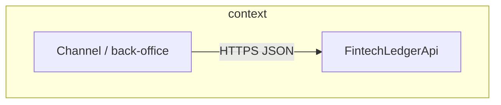
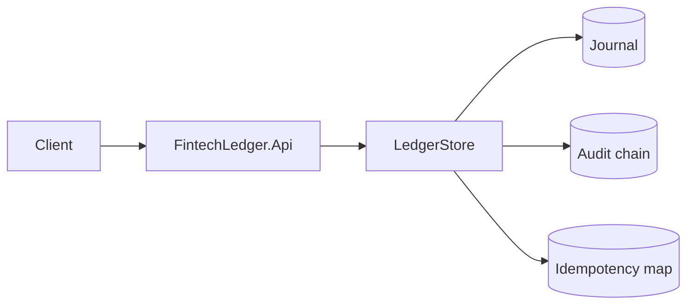
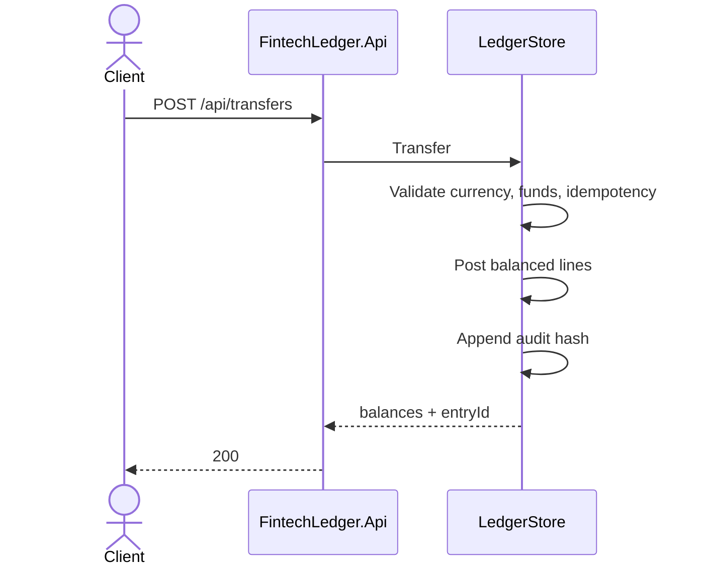
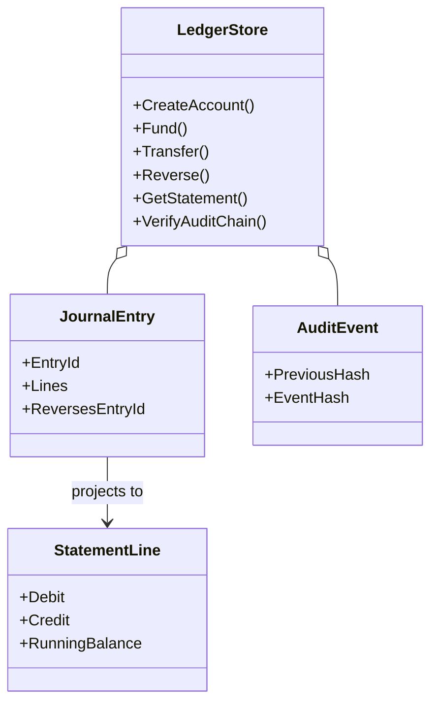

# FintechLedgerApi

Double-entry ledger HTTP service for opening accounts, funding via a system clearing account, posting transfers, issuing statements with running balances, reversing mistakes without rewriting history, and verifying a hash-chained audit trail.

Stack: **.NET 10**, ASP.NET Core Minimal APIs. Persistence is **in-memory** so the sample runs without Docker or a database. Treat it as a domain demo, not a production ledger.

## Scope (honest)

| Capability | Status |
|------------|--------|
| Balanced debit/credit journals | Implemented |
| Idempotent fund/transfer/reverse (payload-bound keys) | Implemented |
| ISO 4217 allow-list on account open | Implemented (common codes) |
| Statement lines with running balance | Implemented |
| Append-only reversal | Implemented |
| Tamper-evident audit hash chain | Implemented (in-process) |
| Durable storage / multi-node | Not included |
| FX conversion | Not included |

## Architecture





Sequence for a customer transfer:



## Domain model



## Quick start

```bash
dotnet restore
dotnet test
dotnet run --project FintechLedger.Api
```

Base URL: `http://localhost:5182`  
OpenAPI: `/openapi/v1.json`

## API

| Method | Path | Notes |
|--------|------|-------|
| POST | `/api/accounts` | ISO 4217 currency required |
| GET | `/api/accounts/{id}` | |
| GET | `/api/accounts/{id}/balance` | Derived: Σdebit − Σcredit |
| POST | `/api/accounts/{id}/fund` | Against `SYS-CLEARING-{CCY}` |
| POST | `/api/transfers` | Same-currency, sufficient funds |
| POST | `/api/journal/reverse` | New reversing entry only |
| GET | `/api/accounts/{id}/statement` | Newest first, running balance |
| GET | `/api/audit` | Hash-chained events |
| GET | `/api/audit/verify` | Chain + global balance check |
| GET | `/health` | |

Reusing an idempotency key with a **different** amount or account set returns `400`.

## Verification

```bash
dotnet test
```

Includes domain tests (balance, reverse, currency, idempotency conflict) and HTTP tests (security headers, OpenAPI, end-to-end posting, oversized body).

## Documentation site

Open [docs/index.html](docs/index.html) for the C4/UML overview page. Longer notes: [docs/architecture.md](docs/architecture.md), [docs/uml.md](docs/uml.md).

## License

MIT — see [LICENSE](LICENSE).
