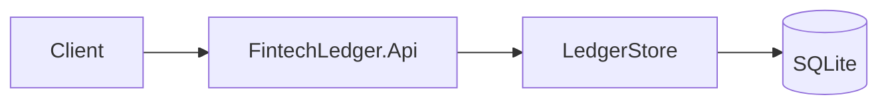

# FintechLedgerApi

MVP double-entry ledger HTTP API: open accounts, fund via system clearing, transfer, reverse without rewriting history, statements with running balance, and a tamper-evident audit hash chain.

Stack: **.NET 10**, ASP.NET Core Minimal APIs, **EF Core + SQLite** (durable file). Docker Compose mounts a volume for the database.

## Scope (honest)

| Capability | Status |
|------------|--------|
| Balanced debit/credit journals | Implemented |
| Idempotent fund/transfer/reverse (payload-bound keys) | Implemented |
| ISO 4217 allow-list on account open | Implemented |
| Statement lines with running balance | Implemented |
| Append-only reversal | Implemented |
| Tamper-evident audit hash chain | Implemented (persisted) |
| SQLite durability (survives process restart) | Implemented |
| Multi-node / Postgres HA | Not included |
| AuthN/AuthZ on API | Not included (pair with BankingAuthService if needed) |
| FX conversion | Not included |

## Run locally

```bash
dotnet run --project FintechLedger.Api
```

```bash
docker compose up --build
```

API listens on `http://localhost:8080` (Docker maps `8081:8080`).

## Test

```bash
dotnet test
```

CI runs restore/build/test on `main` via GitHub Actions.

## Architecture



OpenAPI: `GET /openapi/v1.json` · Health: `GET /health`
