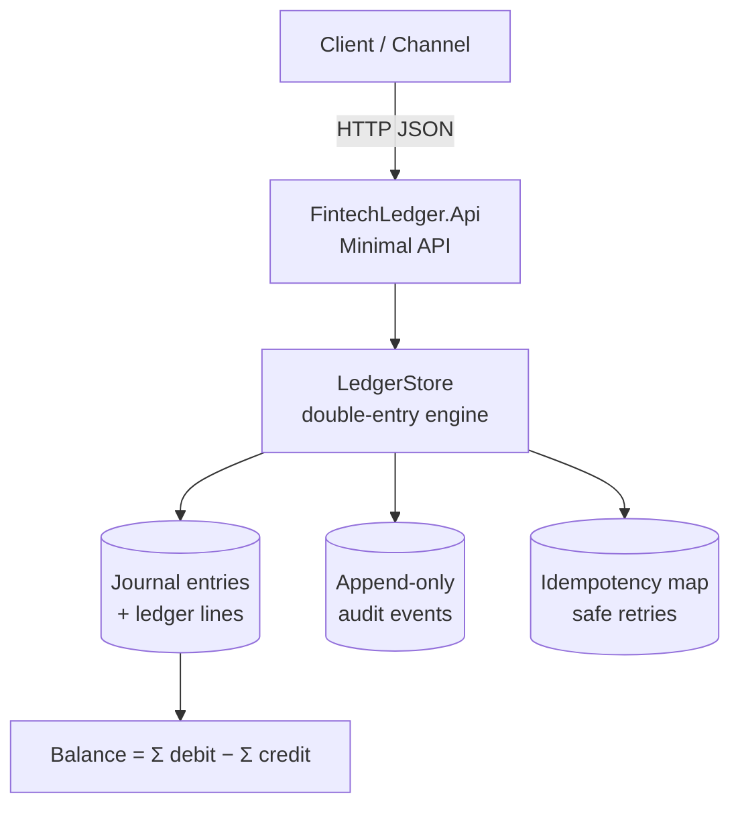
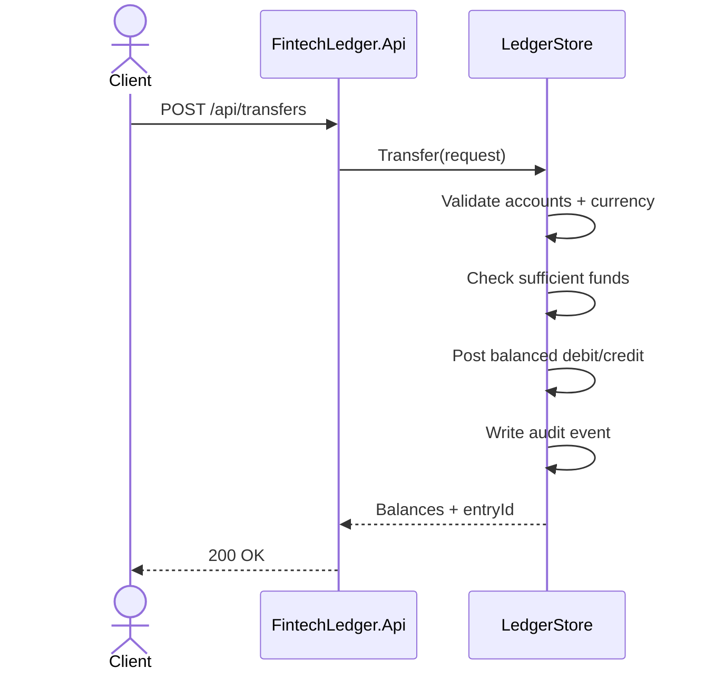
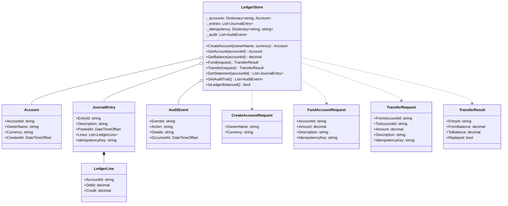

# Fintech Ledger API

Double-entry ledger microservice for account balances, money transfers, idempotent posting, and audit trails.

Built with **.NET 10** and Minimal APIs. Storage is in-memory so the project runs with zero infrastructure while still demonstrating core banking ledger rules.

## Architecture



Transfer flow:



## Why this project

Retail and corporate banking platforms rely on balanced journals, safe retries, and immutable audit history. This repository shows those building blocks in a compact, testable API.

## Features

- Account opening (`TRY` / `USD` / other ISO currency codes)
- Double-entry transfers (every debit has a matching credit)
- Idempotency keys for safe client retries
- Account statement and running balance
- Append-only audit events
- OpenAPI document at `/openapi/v1.json`

## Domain model

Class-level view of the main types and how they relate (fields, operations and dependencies).



## Quick start

```bash
dotnet restore
dotnet test
dotnet run --project FintechLedger.Api
```

API base URL (HTTP): `http://localhost:5182`

## Example flow

```bash
# 1) Create a customer account
curl -s -X POST http://localhost:5182/api/accounts -H "Content-Type: application/json" -d "{\"ownerName\":\"Alice\",\"currency\":\"TRY\"}"

# 2) Fund Alice from the internal system clearing account
curl -s -X POST http://localhost:5182/api/accounts/ACC-.../fund -H "Content-Type: application/json" -d "{\"amount\":1000,\"description\":\"Opening\",\"idempotencyKey\":\"open-alice-1\"}"

# 3) Transfer between funded accounts
curl -s -X POST http://localhost:5182/api/transfers -H "Content-Type: application/json" -d "{\"fromAccountId\":\"ACC-...\",\"toAccountId\":\"ACC-...\",\"amount\":120,\"description\":\"Payment\",\"idempotencyKey\":\"pay-1\"}"

# 4) Read balance / statement / audit
curl -s http://localhost:5182/api/accounts/ACC-.../balance
curl -s http://localhost:5182/api/accounts/ACC-.../statement
curl -s http://localhost:5182/api/audit
```

## API overview

| Method | Path | Description |
|--------|------|-------------|
| `POST` | `/api/accounts` | Create account |
| `GET` | `/api/accounts/{id}` | Get account |
| `GET` | `/api/accounts/{id}/balance` | Current balance |
| `POST` | `/api/accounts/{id}/fund` | Opening deposit via system clearing |
| `POST` | `/api/transfers` | Post transfer (rejects insufficient funds) |
| `GET` | `/api/accounts/{id}/statement` | Journal lines for account |
| `GET` | `/api/audit` | Audit trail |
| `GET` | `/health` | Health check |

### Transfer body

```json
{
  "fromAccountId": "ACC-XXXXXXXX",
  "toAccountId": "ACC-YYYYYYYY",
  "amount": 120.50,
  "description": "Invoice 42",
  "idempotencyKey": "client-retry-key-1"
}
```

Opening balances go through `POST /api/accounts/{id}/fund`, which posts against an internal system clearing account. Customer-to-customer transfers always enforce sufficient funds.

## Design notes

- Balance formula: `sum(debit) - sum(credit)`
- A transfer credits the source account and debits the destination account in one journal entry
- Replaying the same `idempotencyKey` returns the original entry without posting twice
- Currency mismatch and insufficient funds are rejected with clear errors

## Tests

```bash
dotnet test
```

Coverage focuses on balanced posting, insufficient funds, currency checks, idempotent retries, and audit emission.

## License

MIT — see [LICENSE](LICENSE).

<!-- docs: maintenance pass 2026-05-12 -->
