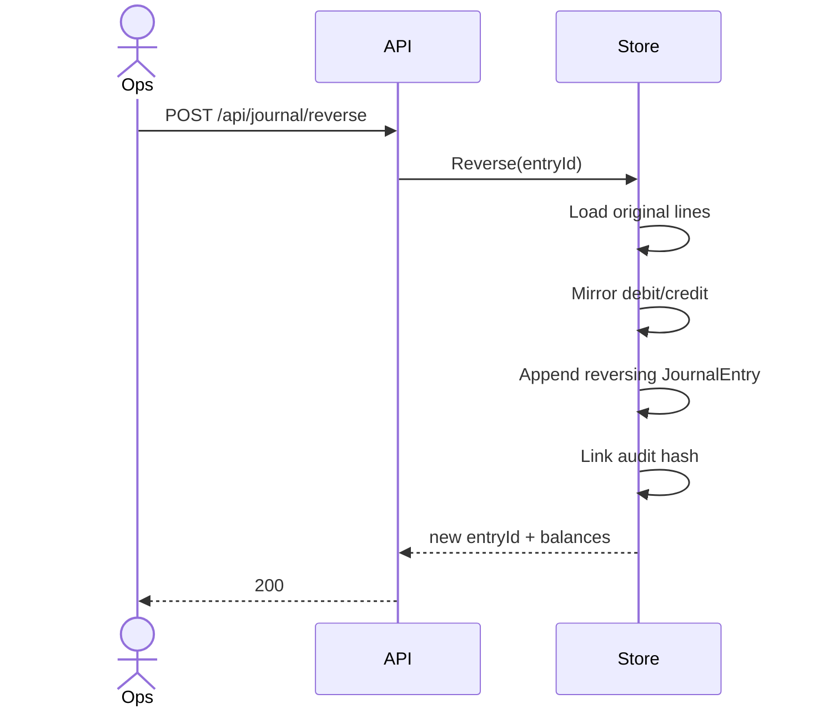

# UML views

## Class view

Primary types live under `FintechLedger.Api.Domain`:

- `LedgerStore` — application service / aggregate root for the in-memory ledger
- `Account`, `JournalEntry`, `LedgerLine` — journal structure
- `StatementLine` — read model with running balance
- `AuditEvent` — hash-chained security log
- Request/result records for HTTP binding

See also the class diagram embedded in the root README.

## Sequence: reverse a transfer

## State of a journal entry

Posted entries do not change state fields. A logical "reversed" condition is inferred when another entry references `ReversesEntryId`.
